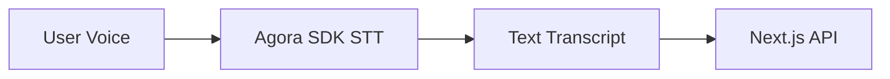
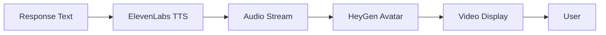

# Principal AI - Voice-Powered Codebase Engineer

A real-time ai principal engineer avatar that enables natural conversations with any GitHub codebase that implements the alexandria documentation standard. Enter a repository URL, and engage in an immersive discussion with a photorealistic avatar that fields questions that you may have about the codebase and provides references and drawings that you could use to improve you developers velocity.

## Demo

[Demo Video Coming Soon]

**Live Demo:** [Link to deployed application]

## What It Does

Principal AI transforms how developers understand and navigate codebases by providing:

- **Natural Voice Conversations**: Ask questions about architecture, implementation patterns, and design decisions using your voice
- **Context-Aware Responses**: Leverages the MemoryPalace documentation pattern to provide intelligent answers grounded in actual codebase structure
- **Immersive Experience**: Photorealistic avatar with synchronized lip-sync creates the feeling of pair programming with a senior engineer
- **Real-Time Interaction**: Sub-2-second response latency for fluid, natural conversations

### Example Interactions

- "What's the overall architecture of this project?"
- "Why did they choose this pattern for state management?"
- "How should I add authentication to this system?"
- "Walk me through the data flow for user registration"

## Technology Stack

Principal AI integrates five cutting-edge technologies to create a seamless multimodal experience:

### Core Technologies

- **Agora Conversational AI Engine**: WebRTC-based voice I/O with built-in speech-to-text for real-time audio processing
- **Groq LLM (llama-3.1-8b-instant)**: Ultra-fast inference for generating context-aware engineering guidance
- **ElevenLabs TTS**: Natural, expressive text-to-speech with professional voice quality
- **HeyGen Streaming Avatar API**: Photorealistic avatar rendering with real-time lip-sync
- **Appwrite**: Full-stack deployment platform (planned for production hosting)

### Architecture

**Voice Input Flow**


**AI Processing Flow**


**Avatar Output Flow**


## Key Features

### 1. Intelligent Codebase Understanding

Built on the **MemoryPalace** documentation pattern from `@a24z/core-library`, Principal AI:

- Parses `.alexandria/` directories containing codebase views, notes, and guidance
- Structures context hierarchically for efficient LLM consumption
- References specific files and architectural decisions
- Maintains conversation history for coherent multi-turn discussions

### 2. Published NPM Package

The core logic is packaged as [`@principal-ade/ai-brain`](https://www.npmjs.com/package/@principal-ade/ai-brain) (v0.3.2):

- Reusable across multiple interfaces (web, CLI, IDE extensions)
- GitHub adapters for fetching repository documentation
- LLM service with conversation management
- Well-documented API with TypeScript support

### 3. Browser-First Architecture

- **No server-side streaming complexity**: All real-time audio/video via WebRTC
- **Simple REST APIs**: Standard HTTP POST/GET endpoints
- **Client-side SDKs**: Direct browser-to-service communication for optimal performance
- **Scalable deployment**: Serverless architecture with no persistent connections

## Getting Started

### Prerequisites

- Node.js 18+
- Bun (optional, for package development)
- API keys for:
  - Groq API
  - Agora
  - ElevenLabs
  - HeyGen

### Installation

```bash
# Clone the repository
git clone https://github.com/AgoraIO-Community/SFTechWeek-2025-Hackathon.git
cd submissions/Principal-AI

# Install dependencies for web frontend
cd web
npm install

# Set up environment variables
cp .env.example .env
# Add your API keys to .env
```

### Required Environment Variables

```env
GROQ_API_KEY=your_groq_api_key
AGORA_APP_ID=your_agora_app_id
ELEVENLABS_API_KEY=your_elevenlabs_key
HEYGEN_API_KEY=your_heygen_key
```

### Running Locally

```bash
# Start the Next.js development server
npm run dev

# Open http://localhost:3000
```

### Testing Individual Components

We've built dedicated test pages for each integration:

- `/agora-test` - Voice I/O testing
- `/heygen-test` - Avatar rendering
- `/elevenlabs-test` - Text-to-speech
- `/llm-test` - LLM conversation flow

## Project Structure

```
Principal-AI/
├── packages/
│   └── core/                    # @principal-ade/ai-brain npm package
│       ├── src/
│       │   ├── adapters/       # GitHub file system adapters
│       │   ├── services/       # LLM service (Groq)
│       │   └── types/          # TypeScript definitions
│       └── package.json
├── web/                         # Next.js frontend
│   ├── src/
│   │   ├── app/
│   │   │   ├── api/chat/      # Main conversation endpoint
│   │   │   ├── agora-test/    # SDK test pages
│   │   │   ├── heygen-test/
│   │   │   └── elevenlabs-test/
│   │   └── components/         # React components
│   └── package.json
└── docs/                        # Architecture & implementation docs
    ├── ARCHITECTURE.md
    ├── PROJECT_PLAN.md
    └── IMPLEMENTATION.md
```

## How It Works

### 1. Repository Loading

When a user provides a GitHub URL:

1. `GitHubFileSystemAdapter` fetches the `.alexandria/` directory structure
2. Files are cached in memory for fast access
3. `MemoryPalace` from `@a24z/core-library` parses views, notes, and guidance documents
4. Structured context is prepared for LLM consumption

### 2. Voice Conversation Flow

1. **User speaks**: Agora SDK captures voice and converts to text (STT)
2. **Context injection**: MemoryPalace provides relevant codebase documentation
3. **LLM generation**: Groq API generates response with conversation history
4. **Speech synthesis**: ElevenLabs converts response to natural audio
5. **Avatar rendering**: HeyGen displays photorealistic avatar with lip-sync
6. **Real-time display**: WebRTC streams video back to user

### 3. Intelligent Context Management

The system uses a view-aware approach:

- **Views**: High-level architecture documentation with file references
- **Notes**: Contextual insights about specific implementations
- **Guidance**: Repository-wide standards and best practices

This structured approach ensures responses are grounded in actual codebase organization rather than generic advice.

## Why This Matters

### For Developers

- **Faster onboarding**: Understand new codebases through natural conversation
- **Architectural insights**: Get expert-level explanations of design decisions
- **Implementation guidance**: Ask specific questions about where and how to make changes
- **Interactive learning**: More engaging than reading static documentation

### For Teams

- **Knowledge democratization**: Junior developers can access senior-level insights
- **Documentation leverage**: Makes existing `.alexandria/` documentation interactive
- **Reduced context switching**: Stay in flow while getting answers
- **Scalable expertise**: One AI can help multiple developers simultaneously

### Technical Innovation

This project pushes boundaries in several ways:

- **Multimodal AI interaction**: Seamlessly combines voice, text, and visual feedback
- **Real-time knowledge synthesis**: Converts static documentation into dynamic conversations
- **View-aware context**: Novel approach to structuring codebase knowledge for LLMs
- **Browser-first architecture**: Eliminates server-side streaming complexity while maintaining real-time performance

## Compatible Repositories

Principal AI works best with repositories that follow the MemoryPalace documentation pattern:

```
.alexandria/
├── views/           # Codebase architecture views
├── notes/           # Implementation notes and decisions
└── guidance/        # Development standards
```

### Example Repositories

- Any repository using `@a24z/core-library` for documentation
- Projects with structured `.alexandria/` directories
- Codebases with documented architecture and design decisions

## API Documentation

### `/api/chat` (In Development)

```typescript
POST /api/chat
Body: {
  message: string;
  conversationHistory?: Array<{role: string, content: string}>;
  repoUrl?: string;
}

Response: {
  text: string;
  conversationId: string;
}
```

### Core Package API

```typescript
import { LLMService, GitHubFileSystemAdapter, MemoryPalace } from '@principal-ade/ai-brain';

// Fetch and parse repository
const adapter = new GitHubFileSystemAdapter(repoUrl);
const palace = await MemoryPalace.fromAdapter(adapter);

// Generate responses
const llm = new LLMService(apiKey);
const response = await llm.generateConversationResponse(
  message,
  palace,
  conversationHistory
);
```

## Testing

```bash
# Run core package tests
cd packages/core
bun test

# Run frontend type checking
cd web
npm run typecheck

# Run linting
npm run lint
```

## Contributing

We welcome contributions! Key areas for enhancement:

- Additional LLM providers (OpenAI, Anthropic)
- Enhanced context retrieval strategies
- UI/UX improvements
- Performance optimizations
- Documentation examples

## License

MIT

## Team

Built for the Agora Hackathon: Beyond Voice

## Acknowledgments

- **Agora** for real-time communication infrastructure
- **Groq** for blazingly fast LLM inference
- **ElevenLabs** for natural voice synthesis
- **HeyGen** for photorealistic avatar technology
- **Appwrite** for deployment platform
- **@a24z/core-library** for the MemoryPalace documentation pattern

## Learn More

- [Architecture Documentation](./docs/ARCHITECTURE.md)
- [Project Plan](./docs/PROJECT_PLAN.md)
- [Implementation Details](./docs/IMPLEMENTATION.md)
- [NPM Package](https://www.npmjs.com/package/@principal-ade/ai-brain)

---

**Note**: This project is under active development. Features marked as "planned" or "in progress" represent our development roadmap for the hackathon submission.
