# Principal AI - Implementation Plan

### User Input Flow
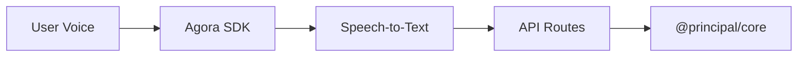

### Core Processing Flow
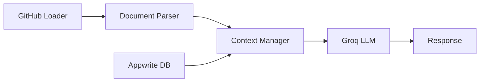

### Avatar Output Flow
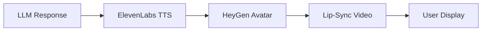

## Phase 1: Foundation & Deployment

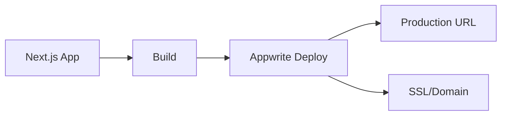

### 1.1 Appwrite Setup
- ✅ Next.js application initialized
- ✅ Appwrite integration configured
- ✅ Theme system (@a24z/industry-theme) integrated
- ✅ Test pages created for each component
- ⏳ Deploy to Appwrite
- ⏳ Configure production environment
- ⏳ Set up domain and SSL

## Phase 2: Service Configuration

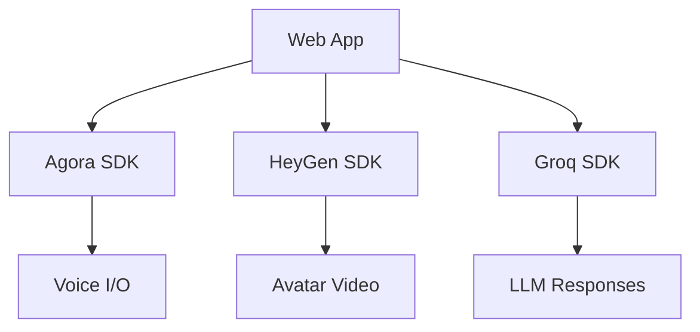

### 2.1 Core Dependencies
- ✅ themed-markdown for documentation display
- ⏳ Agora SDK for voice communication
- ⏳ HeyGen SDK for avatar rendering
- ⏳ Groq SDK for LLM integration
- ⏳ Environment variables configured

### 2.2 API Routes
```
POST /api/load-repo
- Validate GitHub URL
- Fetch repository contents
- Parse documentation
- Store in Appwrite
- Return session ID
```

```
POST /api/chat
- Retrieve session context
- Process message with LLM
- Generate response
- Store conversation history
```

```
WebSocket /api/voice/stream
- Accept audio stream from Agora
- Convert speech-to-text
- Process with LLM
- Generate TTS with ElevenLabs
- Pipe to HeyGen avatar
```

## Phase 3: @principal/core Package

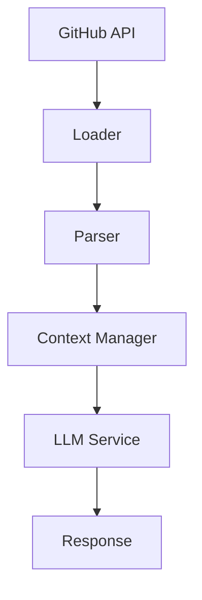

### 3.1 GitHub Loader
- Fetch repository contents via GitHub API
- Extract key documentation files
  - README.md
  - CLAUDE.md
  - ARCHITECTURE.md
  - Other .md files

### 3.2 Document Parser
- Parse markdown files
- Extract structure and sections
- Chunk content for LLM context
- Store with metadata

### 3.3 Context Manager
- Store parsed documentation
- Retrieve relevant context for queries
- Manage chunking strategy
- Handle context windows

### 3.4 LLM Service Integration
- Connect to Groq API
- Implement prompt engineering
- Context injection
- Streaming responses

## Phase 4: Voice Integration

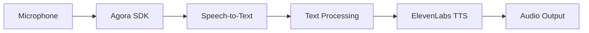

### 4.1 Agora Voice Engine
- Initialize Agora SDK
- Audio input/output handling
- Real-time streaming
- Speech-to-Text integration

### 4.2 Text-to-Speech
- ElevenLabs integration
- Voice selection
- Audio streaming
- Quality optimization

## Phase 5: Avatar Integration

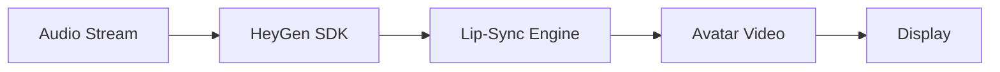

### 5.1 HeyGen Setup
- Initialize HeyGen SDK
- Avatar selection
- Video streaming setup

### 5.2 Lip-Sync
- Audio-to-video synchronization
- Real-time rendering
- Performance optimization

## Phase 6: Frontend Components

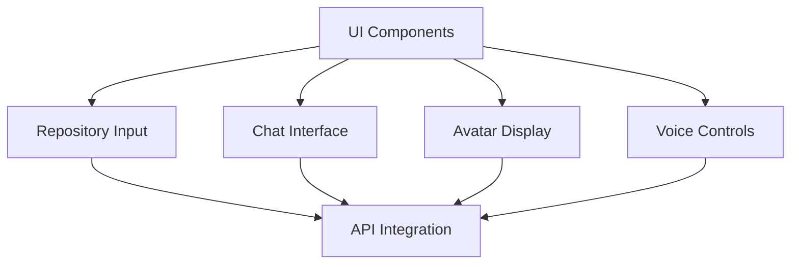

### 6.1 Repository Input
- GitHub URL input form
- Validation feedback
- Loading states
- Error handling

### 6.2 Chat Interface
- Message display
- Input controls
- Conversation history
- Context indicators

### 6.3 Avatar Display
- Video container
- Audio controls
- Connection status
- Visual feedback

### 6.4 Voice Controls
- Microphone toggle
- Audio indicators
- Connection status
- Error states

## Phase 7: Integration & Testing

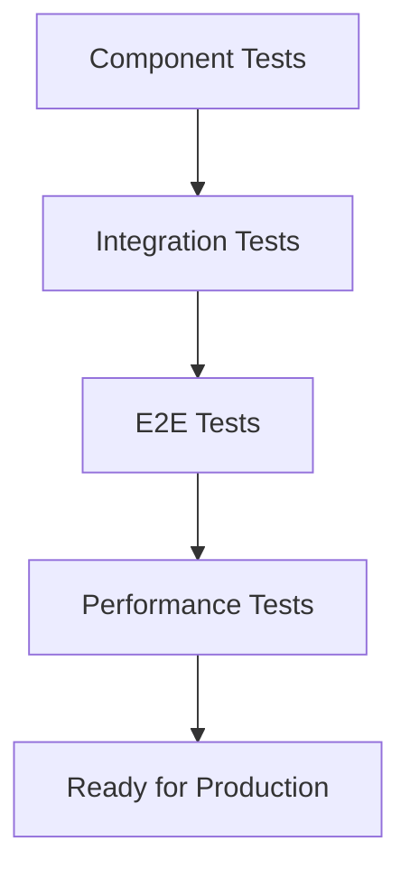

### 7.1 Component Testing
- ✅ Appwrite connection test
- ⏳ GitHub loader test
- ⏳ LLM service test
- ⏳ Agora voice test
- ⏳ HeyGen avatar test

### 7.2 End-to-End Flow
- Load repository
- Process documentation
- Voice conversation
- Avatar response
- Context accuracy

### 7.3 Performance
- Optimize streaming
- Reduce latency
- Memory management
- Error recovery

## Phase 8: Production Deployment

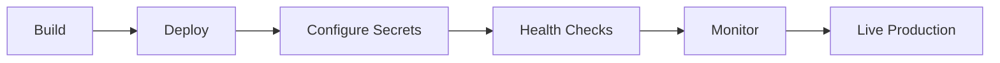

### 8.1 Production Setup
- Environment configuration
- Secret management
- Database migrations
- Service connections

### 8.2 Monitoring
- Error tracking
- Performance metrics
- Usage analytics
- Health checks

## Technology Stack

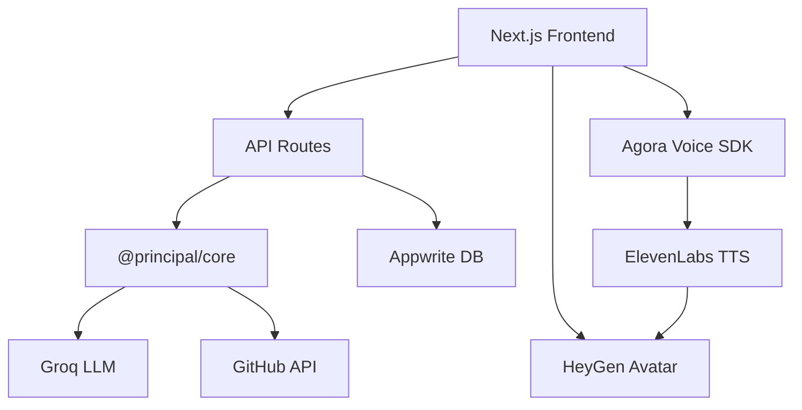

## Current Status

**Completed:**
- Web application foundation
- Theme integration
- Test page framework
- Documentation viewer

**In Progress:**
- API endpoint development
- @principal/core package

**Next Steps:**
1. Complete Appwrite database schema
2. Implement GitHub loader
3. Integrate Groq LLM
4. Add Agora voice streaming
5. Integrate HeyGen avatar
