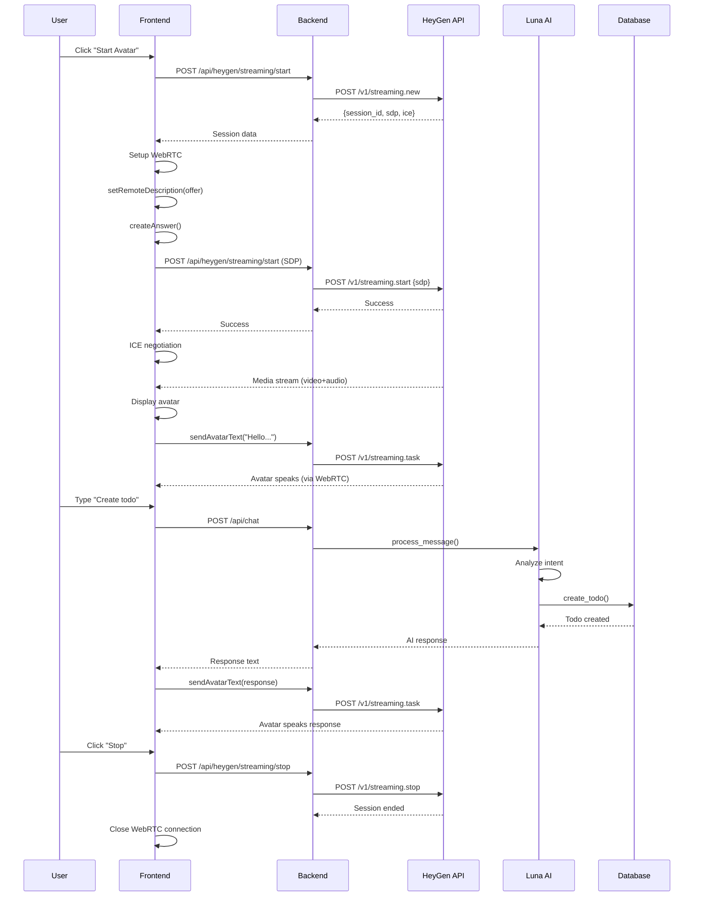

# Video Avatar Technical Architecture

## Table of Contents
1. [Overview](#overview)
2. [System Architecture](#system-architecture)
3. [Component Breakdown](#component-breakdown)
4. [WebRTC Flow](#webrtc-flow)
5. [Event Flow](#event-flow)
6. [Streaming Architecture](#streaming-architecture)
7. [Integration with Luna AI](#integration-with-luna-ai)
8. [Sequence Diagrams](#sequence-diagrams)

---

## Overview

The Video Avatar feature provides a real-time, interactive AI assistant with visual representation using HeyGen's Streaming Avatar API. It combines WebRTC for video streaming with Luna's AI capabilities for intelligent conversation.

### Key Technologies
- **HeyGen Streaming API v1** - Avatar generation and streaming
- **WebRTC** - Real-time peer-to-peer video/audio communication
- **ICE/STUN/TURN** - NAT traversal and connectivity
- **Luna AI Agent** - Groq-powered conversational intelligence
- **Flask Backend** - API orchestration and security

---

## System Architecture

```
┌─────────────────────────────────────────────────────────────┐
│                        Browser Client                        │
├─────────────────────────────────────────────────────────────┤
│  ┌──────────────┐  ┌──────────────┐  ┌─────────────────┐   │
│  │  avatar.js   │  │  app.js      │  │  Video Element  │   │
│  │  (WebRTC)    │  │  (Luna AI)   │  │  (Playback)     │   │
│  └──────┬───────┘  └──────┬───────┘  └────────┬────────┘   │
│         │                  │                   │             │
└─────────┼──────────────────┼───────────────────┼─────────────┘
          │                  │                   │
          │ WebRTC           │ HTTP              │ Media Stream
          │ Signaling        │ REST API          │ (RTP/SRTP)
          │                  │                   │
┌─────────┼──────────────────┼───────────────────┼─────────────┐
│         │     Flask Backend (Python)           │             │
├─────────┼──────────────────┼───────────────────┼─────────────┤
│  ┌──────▼───────┐  ┌──────▼───────┐           │             │
│  │ heygen_      │  │ ai_agent.py  │           │             │
│  │ service.py   │  │ (Groq/Luna)  │           │             │
│  └──────┬───────┘  └──────┬───────┘           │             │
│         │                  │                   │             │
│         │ HTTPS            │ API               │             │
│         │                  │                   │             │
└─────────┼──────────────────┼───────────────────┼─────────────┘
          │                  │                   │
          │                  │                   │
┌─────────▼──────────────────▼───────────────────▼─────────────┐
│                    External Services                          │
├───────────────────────────────────────────────────────────────┤
│  ┌──────────────┐  ┌──────────────┐  ┌──────────────┐       │
│  │   HeyGen     │  │    Groq AI   │  │  STUN/TURN   │       │
│  │  Streaming   │  │   (LLaMA)    │  │   Servers    │       │
│  │     API      │  │              │  │  (Twilio)    │       │
│  └──────────────┘  └──────────────┘  └──────────────┘       │
└───────────────────────────────────────────────────────────────┘
```

---

## Component Breakdown

### 1. Frontend (Browser)

#### **avatar.js** - WebRTC Manager
```javascript
Responsibilities:
├── Session Management
│   ├── Create streaming session with HeyGen
│   ├── Handle session lifecycle (start/stop)
│   └── Manage session state
├── WebRTC Connection
│   ├── PeerConnection setup
│   ├── ICE candidate handling
│   ├── SDP offer/answer negotiation
│   └── Media stream management
├── User Interface
│   ├── Video element rendering
│   ├── Status updates
│   └── Error handling
└── AI Integration
    ├── Send user messages to Luna
    ├── Make avatar speak responses
    └── Coordinate text-to-speech
```

**Key Functions:**
- `startAvatarSession()` - Initiates HeyGen session
- `setupWebRTC()` - Establishes WebRTC connection
- `sendAvatarMessage()` - Processes user input through Luna
- `sendAvatarText()` - Makes avatar speak text
- `stopAvatarSession()` - Cleans up resources

#### **app.js** - Application Logic
```javascript
Responsibilities:
├── Tab Management
├── Chat Interface
├── Todo/Reminder Display
└── API Communication with Backend
```

### 2. Backend (Flask/Python)

#### **heygen_service.py** - HeyGen API Client
```python
Class: HeyGenService
├── Session Management
│   ├── create_streaming_avatar() - Start new session
│   ├── streaming_avatar_speak() - Send text to avatar
│   ├── stop_streaming_avatar() - End session
│   └── get_streaming_ice_servers() - Get ICE config
├── Video Generation (Non-streaming)
│   ├── create_video() - Generate pre-recorded video
│   ├── get_video_status() - Check generation progress
│   └── wait_for_video() - Poll until complete
└── Avatar/Voice Management
    ├── list_avatars() - Get available avatars
    └── list_voices() - Get available voices
```

**API Endpoints:**
- `v1/streaming.new` - Create session
- `v1/streaming.start` - Send SDP answer
- `v1/streaming.task` - Send speech task
- `v1/streaming.stop` - End session

#### **ai_agent.py** - Luna AI Engine
```python
Class: TodoAgent
├── Conversation Management
│   ├── process_message() - Main entry point
│   ├── conversation_history - Context tracking
│   └── reset_conversation() - Clear history
├── Tool Functions
│   ├── create_todo() / update_todo() / delete_todo()
│   ├── get_todos() / complete_todo()
│   ├── create_reminder() / get_reminders()
│   └── delete_reminder()
└── AI Processing
    ├── Groq API integration
    ├── Function calling
    └── Response generation
```

#### **app.py** - Flask Endpoints
```python
Video Avatar Routes:
├── POST /api/heygen/streaming/start
│   └── Create streaming session
├── POST /api/heygen/streaming/speak
│   └── Make avatar speak text
├── POST /api/heygen/streaming/stop
│   └── End streaming session
└── POST /api/heygen/streaming/start (SDP)
    └── Send SDP answer to HeyGen

AI Routes:
├── POST /api/chat
│   └── Process message through Luna
└── POST /api/chat/reset
    └── Clear conversation history
```

### 3. External Services

#### **HeyGen Streaming API**
- **Servers:** Located in AWS (multiple regions)
- **Protocol:** HTTPS REST + WebRTC
- **Streaming:** Real-time video generation
- **Latency:** ~500-1000ms for speech rendering

#### **STUN/TURN Servers (Twilio)**
- **STUN:** Public IP discovery (UDP)
- **TURN:** Relay for restricted networks (UDP/TCP)
- **Ports:** 3478 (STUN/TURN), 443 (TURN-TCP)

#### **Groq AI (LLaMA)**
- **Model:** llama-3.3-70b-versatile
- **Latency:** ~200-500ms per response
- **Function Calling:** Tool use for todo operations

---

## WebRTC Flow

### Phase 1: Session Initialization

```
Browser                    Backend                    HeyGen
  │                          │                          │
  │──1. Start Avatar─────────▶│                          │
  │   (quality: 'low')        │                          │
  │                          │──2. POST /streaming.new──▶│
  │                          │   {quality: 'low'}        │
  │                          │                          │
  │                          │◀─3. Session Response─────│
  │                          │   {session_id, sdp, ice} │
  │◀─4. Session Data─────────│                          │
  │   {session_id, sdp, ice} │                          │
  │                          │                          │
```

**Response Structure:**
```json
{
  "code": 100,
  "data": {
    "session_id": "uuid-string",
    "sdp": {
      "type": "offer",
      "sdp": "v=0\r\no=- ..."
    },
    "ice_servers2": [
      {"urls": ["stun:stun.l.google.com:19302"]},
      {"urls": ["turn:..."], "username": "...", "credential": "..."}
    ],
    "access_token": "jwt-token",
    "url": "wss://heygen-xxx.livekit.cloud",
    "session_duration_limit": 600
  }
}
```

### Phase 2: WebRTC Negotiation (SDP Exchange)

```
Browser                                    HeyGen
  │                                          │
  │──1. RTCPeerConnection.setRemoteDesc─────│
  │   (HeyGen's SDP offer)                  │
  │                                          │
  │──2. RTCPeerConnection.createAnswer()────│
  │   (Generate local SDP answer)           │
  │                                          │
  │──3. RTCPeerConnection.setLocalDesc──────│
  │   (Set our answer)                      │
  │                                          │
  │──4. POST /streaming.start───────────────▶│
  │   {session_id, sdp: answer}             │
  │                                          │
  │◀─5. Confirmation─────────────────────────│
  │   {code: 100, message: 'success'}       │
  │                                          │
```

**SDP Structure:**
```
v=0                           (Version)
o=- ... IN IP4 0.0.0.0       (Origin)
s=-                          (Session name)
t=0 0                        (Timing)
m=video 9 UDP/TLS/RTP/SAVPF  (Media: video)
m=audio 9 UDP/TLS/RTP/SAVPF  (Media: audio)
m=application ... webrtc-dc  (Data channel)
a=candidate:... host ...     (ICE candidates)
a=candidate:... srflx ...    (Server reflexive)
a=candidate:... relay ...    (TURN relay)
```

### Phase 3: ICE Candidate Exchange (Connectivity)

```
Browser                                    HeyGen
  │                                          │
  │──ICE Gathering Starts────────────────────│
  │                                          │
  ├──Generate host candidates───────────────│
  │   (Local network IPs)                   │
  │                                          │
  ├──Generate srflx candidates──────────────│
  │   (Public IPs via STUN)                 │
  │                                          │
  ├──Generate relay candidates──────────────│
  │   (TURN relay addresses)                │
  │                                          │
  ├──ICE Candidate #1 (host)────────────────│
  ├──ICE Candidate #2 (host)────────────────│
  ├──ICE Candidate #3 (srflx)───────────────│
  ├──ICE Candidate #4 (relay)───────────────│
  │   ... (up to 22 candidates) ...         │
  │                                          │
  ├──ICE Candidate null (end)───────────────│
  │                                          │
  │──ICE Checking Phase───────────────────▶  │
  │   (Try each candidate pair)             │
  │                                          │
  │◀─ICE Connectivity Check─────────────────│
  │   (STUN binding requests)               │
  │                                          │
  │──ICE Connected!──────────────────────▶  │
  │                                          │
```

**ICE States:**
```
new → gathering → complete
         │
         ▼
  checking → connected → completed
```

### Phase 4: Media Stream Establishment

```
Browser                                    HeyGen
  │                                          │
  │◀─RTP Video Packets───────────────────────│
  │   (Encrypted with DTLS-SRTP)            │
  │                                          │
  │◀─RTP Audio Packets───────────────────────│
  │   (Opus codec, 48kHz)                   │
  │                                          │
  │──Display in <video> element──────────────│
  │   (Real-time rendering)                 │
  │                                          │
```

**Media Format:**
- **Video:** VP8 codec, ~720p @ 30fps (low quality)
- **Audio:** Opus codec, 48kHz, stereo
- **Transport:** RTP over UDP (or TCP via TURN)
- **Security:** DTLS-SRTP encryption

---

## Event Flow

### Complete User Interaction Flow

```
┌──────────────────────────────────────────────────────────┐
│ 1. USER CLICKS "Start Avatar Session"                   │
└────────────────┬─────────────────────────────────────────┘
                 │
                 ▼
┌──────────────────────────────────────────────────────────┐
│ 2. FRONTEND: startAvatarSession()                        │
├──────────────────────────────────────────────────────────┤
│  • Show loading spinner                                  │
│  • Update status: "Starting session..."                  │
│  • Call backend API                                      │
└────────────────┬─────────────────────────────────────────┘
                 │
                 ▼
┌──────────────────────────────────────────────────────────┐
│ 3. BACKEND: POST /api/heygen/streaming/start            │
├──────────────────────────────────────────────────────────┤
│  • heygen_service.create_streaming_avatar()              │
│  • Request HeyGen API                                    │
│  • Receive session data                                  │
└────────────────┬─────────────────────────────────────────┘
                 │
                 ▼
┌──────────────────────────────────────────────────────────┐
│ 4. HEYGEN API: Session Created                           │
├──────────────────────────────────────────────────────────┤
│  • Generate unique session_id                            │
│  • Create SDP offer                                      │
│  • Allocate streaming resources                          │
│  • Return ICE servers configuration                      │
└────────────────┬─────────────────────────────────────────┘
                 │
                 ▼
┌──────────────────────────────────────────────────────────┐
│ 5. FRONTEND: setupWebRTC(sessionData)                    │
├──────────────────────────────────────────────────────────┤
│  • Create RTCPeerConnection                              │
│  • Set up event handlers:                                │
│    - ontrack (media streams)                             │
│    - onicecandidate (ICE discovery)                      │
│    - oniceconnectionstatechange (connection status)      │
│  • Create <video> element                                │
└────────────────┬─────────────────────────────────────────┘
                 │
                 ▼
┌──────────────────────────────────────────────────────────┐
│ 6. WebRTC: SDP Negotiation                               │
├──────────────────────────────────────────────────────────┤
│  • setRemoteDescription(HeyGen's offer)                  │
│  • createAnswer()                                        │
│  • setLocalDescription(our answer)                       │
│  • Send answer to HeyGen                                 │
└────────────────┬─────────────────────────────────────────┘
                 │
                 ▼
┌──────────────────────────────────────────────────────────┐
│ 7. WebRTC: ICE Candidate Exchange                        │
├──────────────────────────────────────────────────────────┤
│  • Browser generates local candidates                    │
│  • Candidates sent to HeyGen automatically               │
│  • HeyGen sends its candidates                           │
│  • Browser tries candidate pairs                         │
└────────────────┬─────────────────────────────────────────┘
                 │
                 ▼
┌──────────────────────────────────────────────────────────┐
│ 8. WebRTC: Connection Established                        │
├──────────────────────────────────────────────────────────┤
│  • ICE state: checking → connected                       │
│  • DTLS handshake                                        │
│  • SRTP keys exchanged                                   │
│  • Media flow begins                                     │
└────────────────┬─────────────────────────────────────────┘
                 │
                 ▼
┌──────────────────────────────────────────────────────────┐
│ 9. Media Streaming                                       │
├──────────────────────────────────────────────────────────┤
│  • ontrack event fires (video track received)            │
│  • ontrack event fires (audio track received)            │
│  • videoElement.srcObject = stream                       │
│  • Avatar appears on screen                              │
│  • Status: "Active"                                      │
└────────────────┬─────────────────────────────────────────┘
                 │
                 ▼
┌──────────────────────────────────────────────────────────┐
│ 10. Initial Greeting                                     │
├──────────────────────────────────────────────────────────┤
│  • sendAvatarText("Hello! I'm Luna...")                  │
│  • POST /api/heygen/streaming/speak                      │
│  • HeyGen generates lip-synced video                     │
│  • Avatar speaks greeting                                │
└────────────────┬─────────────────────────────────────────┘
                 │
                 ▼
┌──────────────────────────────────────────────────────────┐
│ USER TYPES MESSAGE: "Create a todo to buy groceries"    │
└────────────────┬─────────────────────────────────────────┘
                 │
                 ▼
┌──────────────────────────────────────────────────────────┐
│ 11. Message Processing                                   │
├──────────────────────────────────────────────────────────┤
│  • sendAvatarMessage() called                            │
│  • POST /api/chat (to Luna AI)                           │
│  • Luna processes with function calling                  │
│  • create_todo() function executed                       │
│  • Response: "I've created a todo..."                    │
└────────────────┬─────────────────────────────────────────┘
                 │
                 ▼
┌──────────────────────────────────────────────────────────┐
│ 12. Avatar Response                                      │
├──────────────────────────────────────────────────────────┤
│  • sendAvatarText(Luna's response)                       │
│  • POST /api/heygen/streaming/speak                      │
│  • HeyGen renders avatar speaking                        │
│  • Video stream updated in real-time                     │
│  • User hears and sees Luna respond                      │
└──────────────────────────────────────────────────────────┘
```

---

## Streaming Architecture

### Real-Time Data Flow

```
┌─────────────────────────────────────────────────────────────┐
│                    HeyGen Cloud Infrastructure              │
├─────────────────────────────────────────────────────────────┤
│                                                             │
│  ┌──────────────┐      ┌──────────────┐      ┌──────────┐ │
│  │   Avatar     │──────▶│   Video      │──────▶│  Video   │ │
│  │  Renderer    │       │   Encoder    │       │ Streamer │ │
│  │  (3D/AI)     │       │   (VP8)      │       │  (RTP)   │ │
│  └──────────────┘      └──────────────┘      └─────┬────┘ │
│         ▲                      │                     │      │
│         │                      │                     │      │
│         │                      ▼                     │      │
│  ┌──────┴──────┐      ┌──────────────┐             │      │
│  │   Text      │      │    Audio     │             │      │
│  │  To Speech  │      │   Encoder    │             │      │
│  │             │      │   (Opus)     │             │      │
│  └─────────────┘      └──────┬───────┘             │      │
│                               │                     │      │
└───────────────────────────────┼─────────────────────┼──────┘
                                │                     │
                          Audio RTP              Video RTP
                                │                     │
                                └─────────┬───────────┘
                                          │
                                    WebRTC Stream
                                          │
                                          ▼
┌─────────────────────────────────────────────────────────────┐
│                        Browser Client                        │
├─────────────────────────────────────────────────────────────┤
│                                                             │
│  ┌──────────────┐      ┌──────────────┐      ┌──────────┐ │
│  │     RTP      │──────▶│    Video     │──────▶│  Video   │ │
│  │  Receiver    │       │   Decoder    │       │ Element  │ │
│  │              │       │   (VP8)      │       │  <video> │ │
│  └──────────────┘      └──────────────┘      └──────────┘ │
│                                                             │
│                        ┌──────────────┐      ┌──────────┐ │
│                        │    Audio     │──────▶│  Audio   │ │
│                        │   Decoder    │       │  Output  │ │
│                        │   (Opus)     │       │ (Speakers│ │
│                        └──────────────┘      └──────────┘ │
│                                                             │
└─────────────────────────────────────────────────────────────┘
```

### Packet Flow

**Video Stream:**
```
Avatar Frame (3D) → H.264/VP8 Encode → RTP Packetization
                    → SRTP Encryption → UDP Transport
                    → Network (STUN/TURN) → Browser
                    → SRTP Decryption → RTP Depacketization
                    → VP8 Decode → Canvas/Video Element
```

**Audio Stream:**
```
Text → TTS (HeyGen Voice) → Opus Encode (48kHz)
     → RTP Packetization → SRTP Encryption
     → UDP Transport → Network → Browser
     → SRTP Decryption → Opus Decode
     → Audio Context → Speakers
```

### Network Protocols

**Port Requirements:**
```
STUN: UDP 3478, 19302
TURN: UDP 3478, TCP 3478, TCP 443
RTP/SRTP: UDP 49152-65535 (dynamic range)
HTTPS: TCP 443 (API calls)
WebSocket: TCP 443 (signaling - LiveKit)
```

**Protocol Stack:**
```
Application Layer:  WebRTC API, SDP, ICE
Transport Layer:    UDP (primary), TCP (fallback)
Security Layer:     DTLS (key exchange), SRTP (media encryption)
Media Layer:        RTP (packetization), RTCP (control)
Codec Layer:        VP8 (video), Opus (audio)
```

---

## Integration with Luna AI

### Message Processing Flow

```
┌──────────────────────────────────────────────────────────┐
│ User Input: "Create a todo to buy groceries"            │
└────────────────┬─────────────────────────────────────────┘
                 │
                 ▼
┌──────────────────────────────────────────────────────────┐
│ Frontend: sendAvatarMessage()                            │
├──────────────────────────────────────────────────────────┤
│  POST /api/chat                                          │
│  {                                                       │
│    "message": "Create a todo to buy groceries",         │
│    "session_id": "session_xxx"                          │
│  }                                                       │
└────────────────┬─────────────────────────────────────────┘
                 │
                 ▼
┌──────────────────────────────────────────────────────────┐
│ Backend: agent.process_message()                        │
├──────────────────────────────────────────────────────────┤
│  1. Add to conversation_history                         │
│  2. Send to Groq API (LLaMA-3.3-70b)                    │
│  3. Analyze user intent                                 │
│  4. Decide to call create_todo() function               │
└────────────────┬─────────────────────────────────────────┘
                 │
                 ▼
┌──────────────────────────────────────────────────────────┐
│ AI Agent: Function Calling                              │
├──────────────────────────────────────────────────────────┤
│  tool_call = {                                          │
│    "name": "create_todo",                               │
│    "arguments": {                                       │
│      "title": "Buy groceries",                          │
│      "priority": "medium",                              │
│      "due_date": "2025-01-10"                           │
│    }                                                    │
│  }                                                      │
└────────────────┬─────────────────────────────────────────┘
                 │
                 ▼
┌──────────────────────────────────────────────────────────┐
│ Database: create_todo()                                 │
├──────────────────────────────────────────────────────────┤
│  • db_client.create_todo(...)                           │
│  • Save to Appwrite                                     │
│  • Return todo object                                   │
│  • Function result: "Created todo: Buy groceries..."    │
└────────────────┬─────────────────────────────────────────┘
                 │
                 ▼
┌──────────────────────────────────────────────────────────┐
│ AI Agent: Generate Response                             │
├──────────────────────────────────────────────────────────┤
│  • Send function result back to Groq                    │
│  • AI generates natural response:                       │
│    "I've created a todo to buy groceries with          │
│     medium priority. Is there anything else?"           │
└────────────────┬─────────────────────────────────────────┘
                 │
                 ▼
┌──────────────────────────────────────────────────────────┐
│ Backend: Return to Frontend                             │
├──────────────────────────────────────────────────────────┤
│  {                                                       │
│    "response": "I've created a todo...",                │
│    "session_id": "session_xxx",                         │
│    "timestamp": "2025-01-09T..."                        │
│  }                                                       │
└────────────────┬─────────────────────────────────────────┘
                 │
                 ▼
┌──────────────────────────────────────────────────────────┐
│ Frontend: sendAvatarText(response)                      │
├──────────────────────────────────────────────────────────┤
│  POST /api/heygen/streaming/speak                       │
│  {                                                       │
│    "session_id": "heygen_session_id",                   │
│    "text": "I've created a todo..."                     │
│  }                                                       │
└────────────────┬─────────────────────────────────────────┘
                 │
                 ▼
┌──────────────────────────────────────────────────────────┐
│ HeyGen: Generate Avatar Speech                          │
├──────────────────────────────────────────────────────────┤
│  1. Text-to-Speech (TTS)                                │
│  2. Lip-sync animation generation                       │
│  3. Facial expression synthesis                         │
│  4. Real-time video encoding                            │
│  5. Stream via WebRTC                                   │
└────────────────┬─────────────────────────────────────────┘
                 │
                 ▼
┌──────────────────────────────────────────────────────────┐
│ Browser: Avatar Speaks                                  │
├──────────────────────────────────────────────────────────┤
│  • Video stream updates                                 │
│  • Avatar's mouth moves (lip-sync)                      │
│  • Audio plays through speakers                         │
│  • User sees and hears response                         │
└──────────────────────────────────────────────────────────┘
```

### AI Function Tools

**Available Functions:**
```python
tools = [
    "create_todo",      # Create new todo item
    "get_todos",        # List all todos
    "complete_todo",    # Mark todo as done
    "update_todo",      # Modify todo details
    "delete_todo",      # Remove todo
    "create_reminder",  # Create reminder
    "get_reminders",    # List reminders
    "delete_reminder"   # Remove reminder
]
```

**Function Call Example:**
```json
{
  "role": "assistant",
  "content": null,
  "tool_calls": [{
    "id": "call_abc123",
    "type": "function",
    "function": {
      "name": "create_todo",
      "arguments": "{\"title\":\"Buy groceries\",\"priority\":\"medium\"}"
    }
  }]
}
```

---

## Sequence Diagrams

### Complete Session Lifecycle



---

## Performance Metrics

### Latency Breakdown

```
User Input → Response Time
├── Frontend Processing: ~10ms
├── Network RTT (API): ~50-100ms
├── Luna AI Processing: ~200-500ms
│   ├── Groq API: ~150-400ms
│   ├── Function Execution: ~20-50ms
│   └── Response Generation: ~30-50ms
├── Backend Processing: ~20ms
├── HeyGen TTS: ~300-500ms
└── WebRTC Streaming: ~100-200ms
──────────────────────────────────
Total: ~700-1400ms (0.7-1.4 seconds)
```

### Bandwidth Usage

```
Video Stream (Low Quality):
├── Resolution: ~720p (1280x720)
├── Frame Rate: 30 fps
├── Bitrate: ~500-800 Kbps
└── Bandwidth: ~1 Mbps total

Audio Stream:
├── Codec: Opus
├── Sample Rate: 48 kHz
├── Bitrate: ~64 Kbps
└── Bandwidth: ~100 Kbps

Total Bandwidth: ~1.1 Mbps
```

---

## Security Considerations

### Encryption
- **HTTPS:** All API calls
- **DTLS:** WebRTC key exchange
- **SRTP:** Media stream encryption
- **JWT:** HeyGen session tokens

### Authentication Flow
```
1. Backend validates user session
2. Backend requests HeyGen session with API key
3. HeyGen returns session token (JWT)
4. Frontend uses session token for WebRTC
5. Token expires after session duration (10 min free tier)
```

### Data Privacy
- **Video:** Generated in real-time, not stored
- **Audio:** Text-to-speech, input text not stored
- **User Messages:** Stored in conversation_history (memory only)
- **Todos:** Stored in Appwrite (encrypted at rest)

---

## Troubleshooting Guide

### Common Issues

**1. ICE Connection Fails**
```
Symptoms: "checking" → "failed"
Causes:
- Corporate firewall blocking UDP
- VPN interfering
- TURN servers unreachable
Solutions:
- Disable VPN
- Use different network
- Check firewall rules
```

**2. No Video/Audio**
```
Symptoms: Connection succeeds but no media
Causes:
- Browser autoplay policy
- Video element not attached
- Media tracks not enabled
Solutions:
- User gesture required (click)
- Check srcObject assignment
- Unmute audio element
```

**3. Avatar Not Speaking**
```
Symptoms: Video plays but avatar silent
Causes:
- Text too long
- API rate limit
- Session expired
Solutions:
- Keep text under 500 chars
- Check API quota
- Restart session
```

---

## Future Enhancements

### Potential Improvements
1. **Voice Input** - User speaks instead of types
2. **Emotion Detection** - Avatar reacts to sentiment
3. **Custom Avatars** - User-selected appearance
4. **Screen Sharing** - Avatar presents information
5. **Multi-language** - Support for other languages
6. **Recording** - Save conversations
7. **Background** - Custom environment

---

## Conclusion

The Video Avatar system combines multiple cutting-edge technologies:
- **WebRTC** for real-time communication
- **AI** for intelligent conversation
- **3D Rendering** for lifelike avatars
- **Cloud Infrastructure** for scalability

This creates an immersive, interactive experience that feels like talking to a real assistant.

**Key Takeaways:**
- WebRTC enables peer-to-peer streaming
- SDP/ICE handle connection negotiation
- Luna AI provides intelligence
- HeyGen renders realistic avatars
- Integration creates seamless UX

---

**Document Version:** 1.0  
**Last Updated:** January 9, 2025  
**Author:** Luna AI Assistant Project

